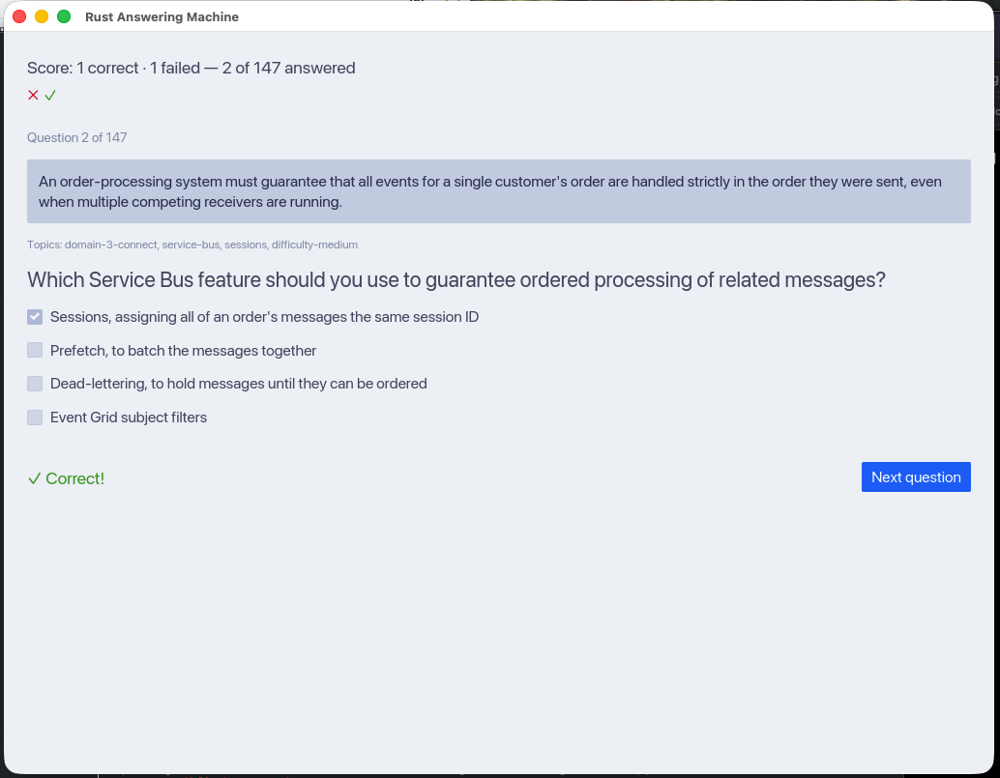

# StudyDeck

A tiny desktop app for studying by self-quizzing — built to help you prep for exams.



## What it is

StudyDeck loads a folder of question scenarios and quizzes you on them.
It's a native desktop app written in Rust with [`iced`](https://iced.rs).

## Run

```sh
cargo run                  # uses the bundled ./example-questions folder
cargo run -- path/to/dir   # study your own folder of questions
```

## Question format

Each `*.json` file in the folder is one **scenario**: an optional intro text,
a list of `tags`, and one or more questions. Two question types are supported:

- **MultipleChoice** — pick the correct option(s); one or more can be right
  (also covers yes/no questions).
- **OrderingTask** — arrange the options into the correct order; extra
  "red herring" options are allowed.

```json
{
  "scenario_description": "Optional intro shared by all questions below.",
  "questions": [
    {
      "MultipleChoice": {
        "question_text": "Which properties are captured by the ACID acronym?",
        "options": ["Atomicity", "Consistency", "Availability", "Isolation", "Durability"],
        "correct_answers": [0, 1, 3, 4]
      }
    }
  ],
  "tags": ["databases", "transactions"]
}
```

See the [`example-questions/`](example-questions) folder for working examples of
both question types. A larger set of real question data is available at
[StudyDeckQuestions-Ai200-Examen](https://github.com/nilsmartel/StudyDeckQuestions-Ai200-Examen).
